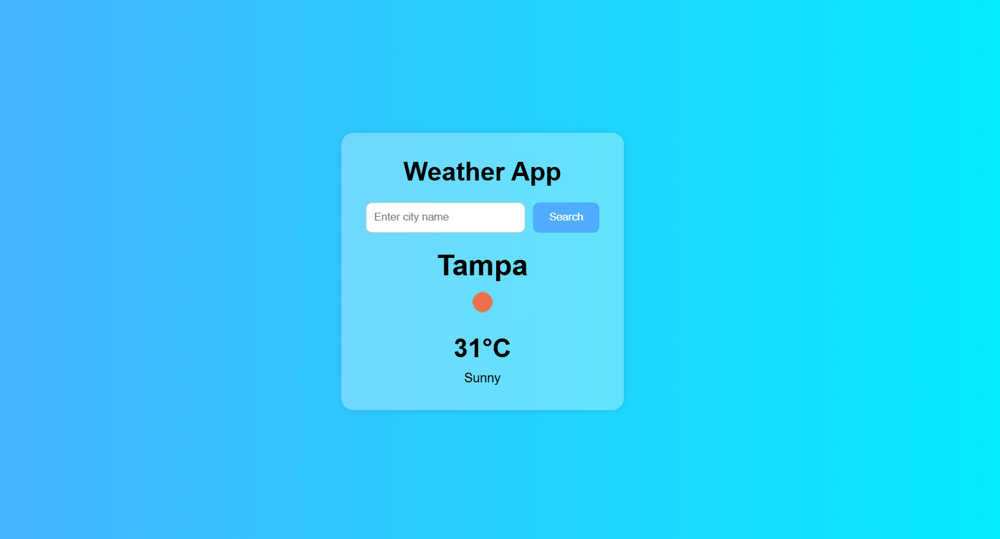

# Weather App

Responsive weather application built with HTML, CSS and JavaScript using the OpenWeather API.

## Features

- Search weather by city
- Display temperature
- Display weather conditions
- Error handling
- Dynamic UI updates

## Technologies Used

- HTML5
- CSS3
- JavaScript
- OpenWeather API

## Live Demo

https://stephaniesantos8.github.io/weather-app-js/

## Screenshot

